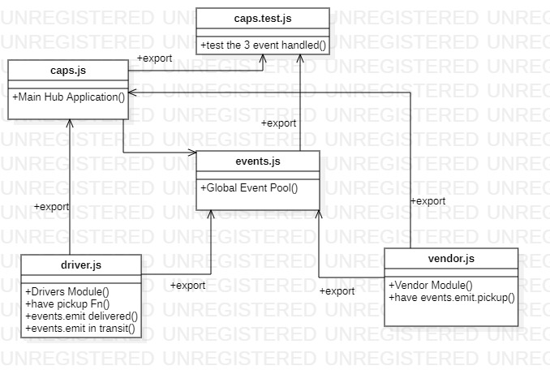
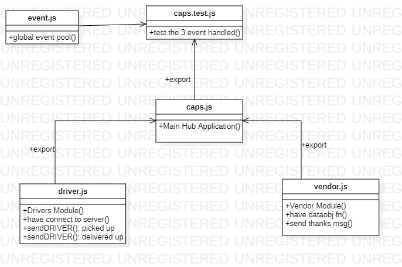

# caps


**labs**     | **URL**
------------ | -------------
Home         | [Home](https://github.com/laith-401-advanced-javascript/caps)
 class-16    | [class-16](https://github.com/laith-401-advanced-javascript/caps/pull/1)
class-17    | [class-17](https://github.com/laith-401-advanced-javascript/caps/pull/2) class-18    | [class-18](https://github.com/laith-401-advanced-javascript/caps/pull/3)


## Events (CAPS)

Code Academy Parcel Service (CAPS)
A real-time service that allows for vendors, such as flower shops or restaurants, to alert a system of a package needing to be delivered, for drivers to instantly see what’s in their pickup queue, and then to alert the vendors as to the state of the deliveries (in transit, and then delivered).


#### How to initialize/run your application (where applicable)

-  `node caps.js`


### date

---
date: 2020-9-27 10:00
---

### author

 Laith Al Daree
---

### location

---
Az Zarqa-Al Azraq-Jordan
---


### Contact 
```
---
Email:mr.laith_2011@hotmail.com
GitHub:https://github.com/laith-2020
linkedIn :https://www.linkedin.com/in/laith-aldaree/
---
```


* if you have any quastion feel free to send me an 
  email : mr.laith_2011@hotmail.com


# Action gitHub link 
```
[actiontest](https://github.com/laith-401-advanced-javascript/caps/actions/runs/275340131)
```

# uml

lab 16 :



lab 17:

